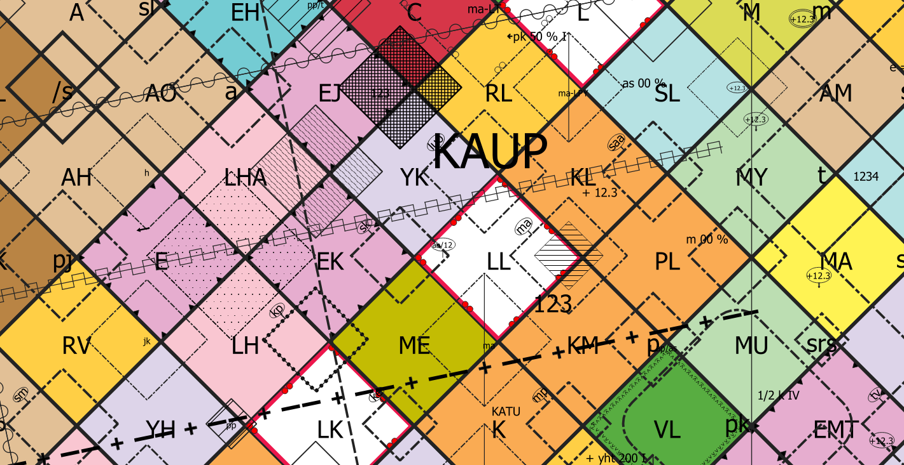

# Paikkatieto
Paikkatietoon liittyvää materiaalia

## Asemakaavan kuvaustekniikka

Asemakaavan kuvaustekniikka (CC BY 4.0)
- [QGISin tyylitiedosto, xml](asemakaavan_kuvaustekniikka.xml) (28.5.2020 versio 1.1)
- SLD-visualisointikirjasto (tulossa)

Toteutus Gispo Oy, kevät 2020. 

### Ohjeet käyttöönottoon

HUOM! Kuvaustekniikka on tehty uusimmalla [QGIS-versiolla](https://qgis.org/en/site/forusers/download.html) (3.10 tai uudempi). Vanhoilla versioilla tyyli ei toimi, sillä aiempiin versioihin nähden tyylien määrittelyyn tullut huomattavasti muutoksia QGISissä.

1. Lataa XML-muotoinen tyylikirjasto koneellesi ja avaa QGIS. Kohdasta **Asetukset > Tyylien hallinta** avautuvassa paneelissa voit importoida (tuoda) XML-tyylin QGISiin. Valitse kaikki ja Tuo tiedot. 

2.  Käytä omaa aineistoa ja luokittele aineistosi QGISin tason tyylit-kohdassa. Määrittele haluamallesi kohteille sopivat tyylit. Muista, että tyylikirjasto koostuu polygoneista, viivoista ja pisteistä. Pistemäiset tyylit *eivät* näy polygoneille ja toisinpäin. 
